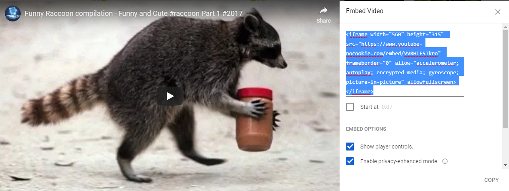

## Editing GitHub Pages

<iframe width="560" height="315" src="https://www.youtube.com/embed/xDDKYBWD7N8" frameborder="0" allow="accelerometer; autoplay; encrypted-media; gyroscope; picture-in-picture" allowfullscreen></iframe>

<br>
------- 
<br>

**You must register for GitHub and send your ID to the instructor in order to be added to the project and given permission to edit files.** 

## Drafting Your Chapter

You are responsible for creating chapters that present key insights for each topic. The purpose of the exercise is to work collaboratively to create a robust set of notes that can serve as a future reference guide so you can remind yourself about details of the course or quickly identify chapters or articles you want to revisit. Different topics might require different approaches (some lend themselves to check-lists or best-practices, while others might focus on clearly articulating an idea or area of research.). 

In general, I would recomment approaching the assignment as an opportunity to make yourself into an expert on your topic, then sharing your knowledge in a _**clear**_ and _**concise**_ manner with classmates and the general public. Your name will be on each chapter, so submit something that you are willing to own. 

Your chapter should have four parts:

---


## (1) Topic Overview (approximately 1 page)

Summarize the themes and insights that are common across the readings. Organize them into a coherent topic overview.

Make sure to reference the evidence and data the authors use to support their arguments, when appropriate. 

When appropriate, go beyond a summary and offer your own analysis or a framework for best practices. 

---


## (2) Summaries (approximately 0.5 pages each)

Provide summaries of key arguments and insights provided in each chapter. This should be short, typically about half a page. 

Summary format will vary by content - sometime material is best organized with a few paragraphs of text, others with itemized lists, and in other cases you might want to include graphics or diagrams illustrate content. 

---


## (3)  Discussion Points

Each member will contribute a discussion question to Yellowdig based on your chapter content. It can be specific to one of the chapters or a theme that ties them together. 

You are free to use whichever medium you like for the discussion questions. If you would like to post a video:

1. Upload the video to a video platform like YouTube, and insert an iframe of the video into your document.  
2. In YouTube, you will find iframes by clicking on the Share option, and the "Embed" icon. 



3. Paste this text into your markdown document, and it will add the video to your page:  

```
<iframe width="560" height="315" src="https://www.youtube-nocookie.com/embed/VVRHTF5Ikro" frameborder="0" allow="accelerometer; autoplay; encrypted-media; gyroscope; picture-in-picture" allowfullscreen></iframe>
```

<iframe width="560" height="315" src="https://www.youtube-nocookie.com/embed/VVRHTF5Ikro" frameborder="0" allow="accelerometer; autoplay; encrypted-media; gyroscope; picture-in-picture" allowfullscreen></iframe>

---

## Adding Images

If you want to include images you need to add the image file to the [images folder](https://github.com/DS4PS/data-driven-management-textbook/tree/master/images) in this repository. Web-friendly formats like PNG, JPEG, or GIF are preferred. 

You can just drag and drop the images into the folder, and GitHub will automatically initiate an upload option. After the upload progress bar is complete, click on the green "Commit changes" icon to complete the upload process.

You will then reference images in text using markdown syntax (see the Markddown Guide above for more details):


```

```

---


## (4) Citations and Bibliography

Cite material using the APA in-text citation style, e.g. Johnson (2012, p. 27). 

A bibliography for the assigned readings are already listed on the page shell. 

You are free to include additional material in the chapter if you want to explore beyond the assigned texts or reference other readings from the course. If you do, be sure to add the new sources to the bibliography. 


### Groups

**Team 1:**  
Robert Lott  
James Hogue  
Kirsten VanDeventer  

**Team 2:**  
Annie Ackroyd  
Victoria Adair  
Bret Petersen  

**Team 3:**  
Cody Lundell  
Christina Worden  
Daniel Gabiou  

**Team 4:**  
Martha Ramos  
Philip Schlotter  
Randolph Wilkins  

**Team 5:**  
Troy George  
Jamie Bandy  


